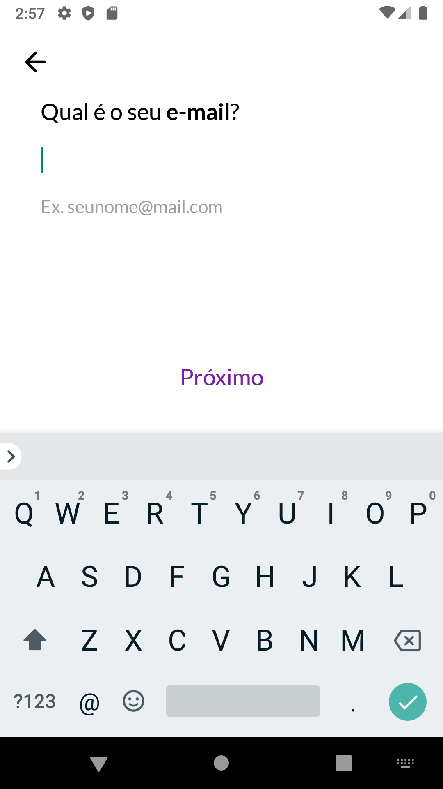
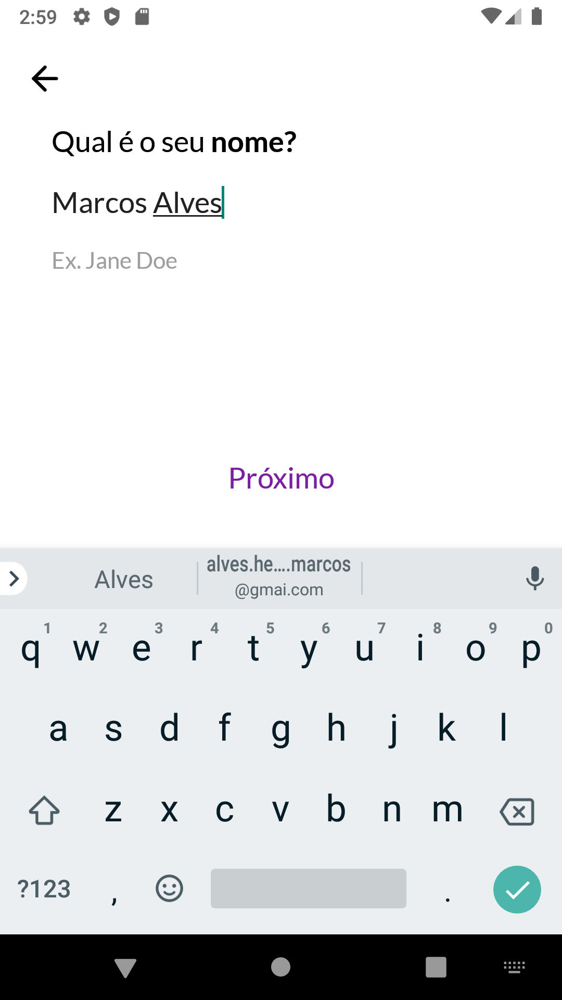
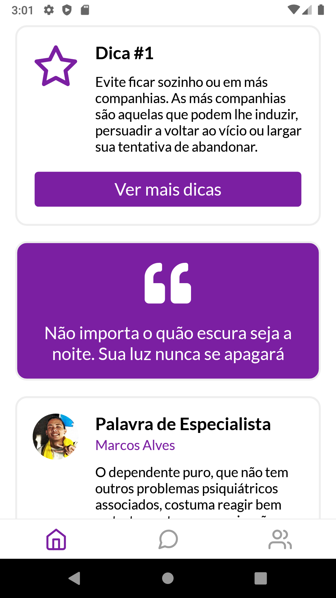
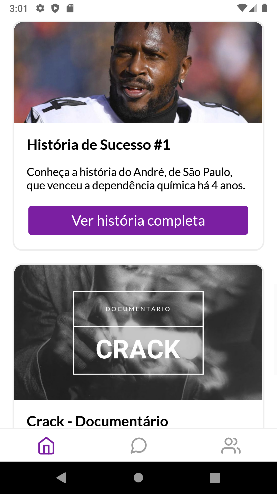
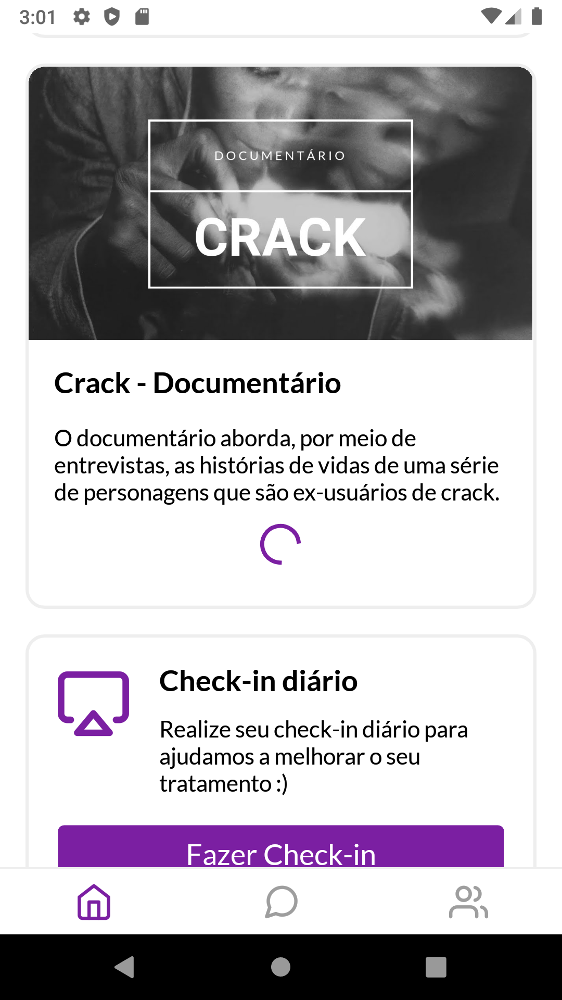
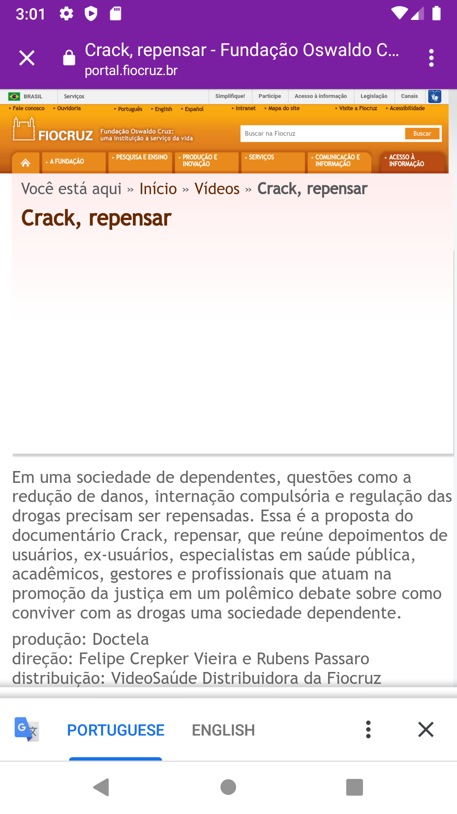

# Hope
Hackathon Fuze.cc and NPE/LAViD

# Features

* Serviço de administração (CRUD) de usuários e conteúdos digitais (cards); :white_check_mark:
* Serviço de autenticação utilizando tokens (inclusive com funcionalidade de "Esqueci a senha"); :white_check_mark: *NOTA: não implementado no aplicativo ainda*
* Serviço de notificação de mensagens de envio para o dispositivo a partir do administrador do aplicativo; :x:
* Serviço de comunicação síncrona (chats) entre usuários (por cadastro ou id do dispositivo); :x:

# Screencast

[Click here](https://drive.google.com/file/d/1_hAJtnrymceXZ36fQvbhSqs386l6k4mP/view?usp=sharing)

# Screenshots

 

 

 

 

 

 

 

 

 
